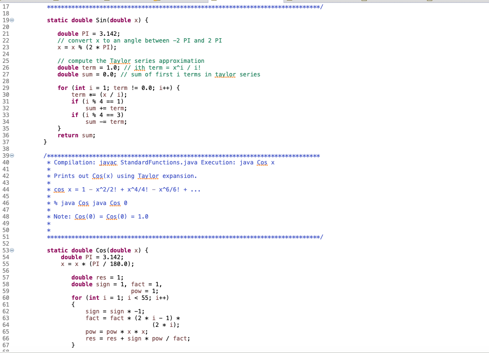

# UnitTesting

# Version 1.0

In this version all the functions are created without implementation along with test cases. As in Test
Driven Development we write test cases before the actual implementation, so same thing is done 
in this version. All the test cases will be failed as there is no implementation.

# Methods without implementations

# Methods test cases

# Failed test cases

# Version 2.0

In this version all the functions implemented as in Test Driven Development after writing test cases second step is implementation.

# Implemented all the methods

 
# Output

# Version 3.0

Added test cases which includes all possible inputs for functions. 

# Added test cases

# Test case result

Test cases results shows that some of the test cases are getting failed therefore implementation 
requires corrections.

# Version 4.0

# Test case result

In this version all the test cases are getting passed, which shows that all the functions has been implemented correctly.

# Test case coverage

It shows that how much code has been covered by testing, as per the standard if code is covered in testing 
more than 80% which means quality of code is good.
